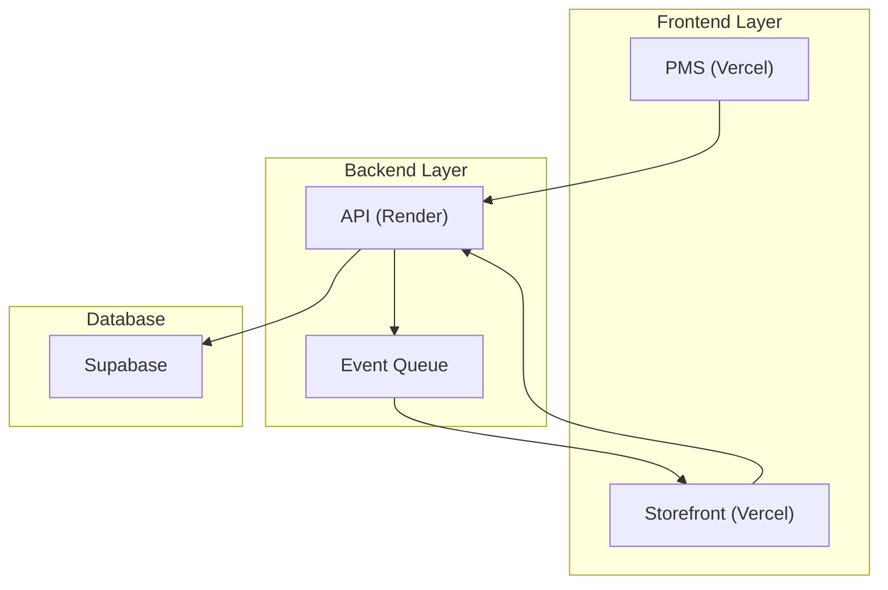

# PMS Backend Service

Backend service for Product Management System (PMS) and Storefront integration.

## 📋 Project Status

View detailed implementation status and roadmap in [TODO.md](docs/TODO.md)

- Overall Progress: 75% Complete
- Current Phase: Integration & Event System Implementation
- Next Milestone: Webhook System & Real-time Updates

## 🏗 Architecture




## 🚀 Quick Start

```bash
# Install dependencies
pnpm install

# Set up environment
cp .env.example .env

# Run development server
pnpm dev

# Run tests
pnpm test
```

## 🔑 API Authentication

- Required: API Key in `X-API-Key` header
- Generate key: `pnpm generate-key`

## 📦 Core Features

1. Product Management
   - CRUD operations
   - Status transitions
   - Image handling

2. Inventory Control
   - Stock tracking
   - Movement history
   - Alerts system

3. Order Processing
   - Creation/updates
   - Status management
   - Refund handling

## 🔄 Integration Points

### PMS Integration
- Product publishing workflow
- Inventory management
- Order processing

### Storefront Integration
- Product availability
- Stock synchronization
- Order creation

## 🧪 Testing

```bash
# Run all tests
pnpm test

# Run specific test suite
pnpm test:unit
pnpm test:integration
pnpm test:e2e
```

## 📚 Documentation

- [Architecture Overview](docs/ARCHITECTURE.md)
- [API Documentation](docs/API.md)
- [Database Schema](docs/SCHEMA.md)
- [Implementation Status](docs/TODO.md)

## 🛠 Development

### Prerequisites
- Node.js v18+
- pnpm
- PostgreSQL (Supabase)

### Environment Setup
Required environment variables:
```bash
DATABASE_URL=          # Supabase connection string
API_KEY=              # Generated API key
PMS_URL=              # PMS frontend URL
STOREFRONT_URL=       # Storefront URL
```

### Database Migrations
```bash
pnpm migrate:latest   # Run migrations
pnpm migrate:rollback # Rollback last migration
```

## 🚀 Deployment

Current deployment on Render:
- URL: https://backendpms-wvoo.onrender.com
- Auto-deploys from `main` branch

## 📈 Monitoring

- Health Check: `/health`
- Metrics: `/metrics`
- Status: `/status`

## 🔜 Next Steps

See [TODO.md](docs/TODO.md) for detailed implementation roadmap.

1. Event Queue System
2. Webhook Implementation
3. Real-time Updates
4. Caching Layer
5. Rate Limiting

## 🤝 Contributing

1. Fork the repository
2. Create feature branch
3. Commit changes
4. Push to branch
5. Create Pull Request

## 📄 License

MIT License - see [LICENSE](LICENSE)