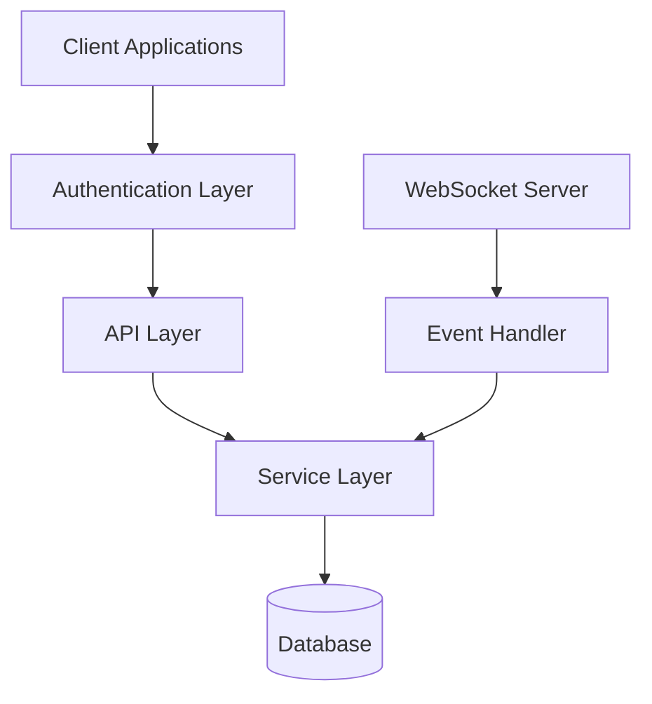
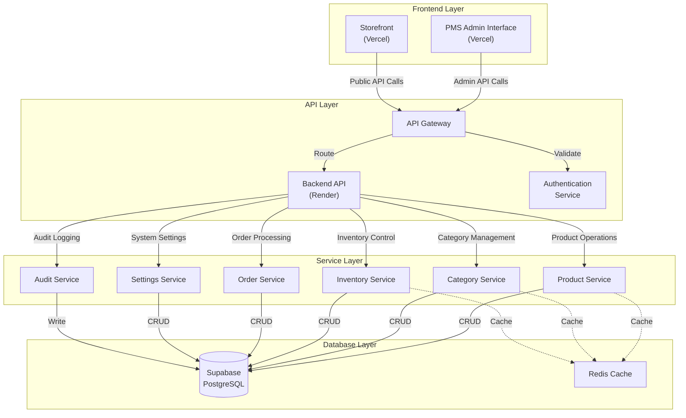
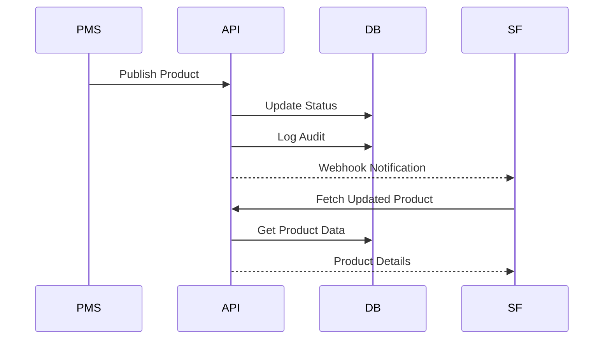
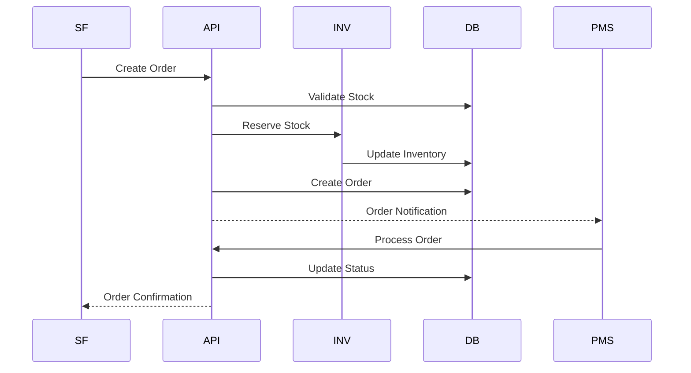
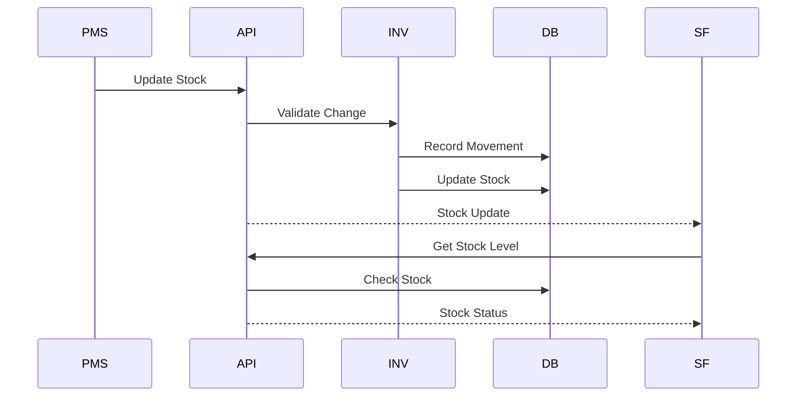
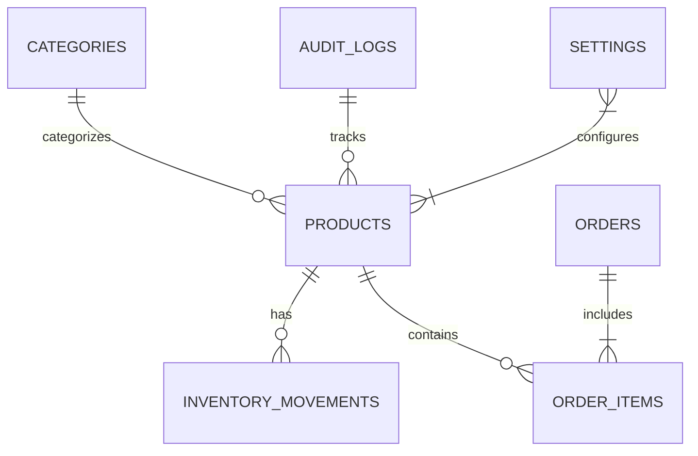
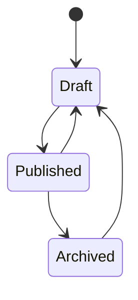
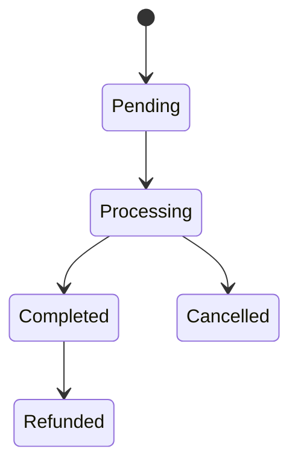
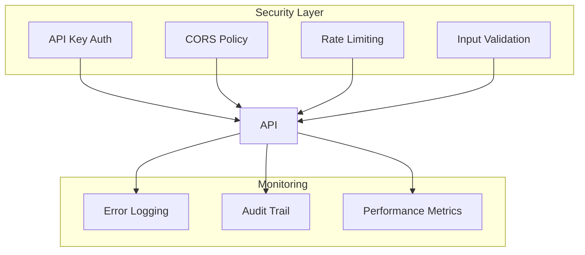

# Backend Architecture Documentation

# System Architecture

## Current Implementation

## Required Components

### 1. Event System
- Event Bus
- Message Queue
- Real-time Updates

### 2. Data Flow
- Validation Layer
- Transaction Management
- Cache Layer

### 3. Integration Points
- Webhook System
- External Services
- Monitoring System

## Security Architecture
- Authentication Flow
- Authorization Rules
- Data Protection

## Complete System Architecture

## Module Interactions

### Product Publishing Flow

### Order Processing Flow

### Inventory Management Flow

## Data Flow Architecture

### Database Schema Relationships

## State Transitions

### Product Status Flow

### Order Status Flow

## Security Architecture

This architecture ensures:
1. Clear separation of concerns
2. Scalable microservices
3. Secure data flow
4. Reliable state management
5. Comprehensive monitoring
