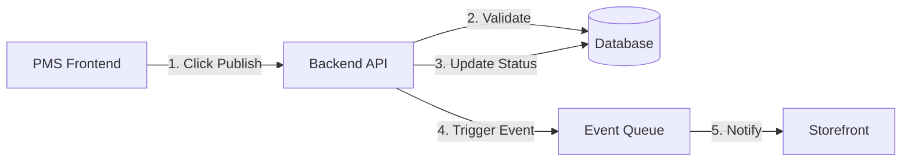
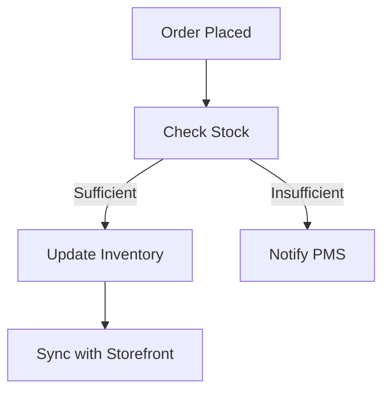

# Backend Implementation Status

## Current Completion: 75%
Remaining Work: 25%

## Core Features Implemented ✅
1. Database Setup and Configuration
2. Basic CRUD Operations
3. Authentication & Authorization
4. Error Handling
5. Testing Framework
6. Basic API Routes

## Remaining Implementation Tasks 🚧

### 1. Product Publishing Flow (10%)


Required Implementation:
- [ ] Add publishing status workflow
- [ ] Implement webhook notifications
- [ ] Add event queue system
- [ ] Create storefront sync logic

### 2. Inventory Management (5%)


Required Implementation:
- [ ] Real-time stock updates
- [ ] Low stock notifications
- [ ] Stock reservation system
- [ ] Inventory sync webhooks

### 3. Integration Points (10%)

#### PMS Integration
- [ ] Webhook endpoints for PMS events
- [ ] Real-time inventory updates
- [ ] Product status management
- [ ] Order management interface

#### Storefront Integration
- [ ] Product availability API
- [ ] Stock level checks
- [ ] Order creation webhook
- [ ] Payment status updates

## API Organization

### PMS Frontend Routes
```typescript
// Product Management
POST /api/pms/products/create       // Create draft product
PUT /api/pms/products/:id/publish   // Publish product
PUT /api/pms/products/:id/unpublish // Unpublish product
PUT /api/pms/products/:id/archive   // Archive product

// Inventory Management
GET /api/pms/inventory/alerts       // Low stock alerts
POST /api/pms/inventory/adjust      // Manual stock adjustment
GET /api/pms/inventory/history      // Stock movement history

// Order Management
GET /api/pms/orders/pending         // View pending orders
PUT /api/pms/orders/:id/process     // Process order
PUT /api/pms/orders/:id/fulfill     // Fulfill order
```

### Storefront Routes
```typescript
// Product Display
GET /api/storefront/products        // List available products
GET /api/storefront/products/:id    // Get product details

// Cart & Checkout
POST /api/storefront/orders/create  // Create order
GET /api/storefront/stock/:id       // Check stock availability
POST /api/storefront/webhook        // Order status updates
```

## Event Flow Examples

### Product Publishing Flow
1. PMS user clicks "Publish"
2. Frontend calls `PUT /api/pms/products/:id/publish`
3. Backend:
   - Validates product data
   - Updates status to 'published'
   - Triggers webhook to storefront
   - Returns success response
4. Storefront receives webhook
5. Storefront updates product visibility

### Order Processing Flow
1. Customer places order on storefront
2. Storefront calls `POST /api/storefront/orders/create`
3. Backend:
   - Validates order
   - Checks stock availability
   - Creates order record
   - Triggers PMS notification
4. PMS receives order notification
5. PMS user processes order
6. Backend updates stock levels
7. Webhook notifies storefront of status change

## Required Environment Variables
```bash
# Add to .env.production
WEBHOOK_SECRET=xxx
STOREFRONT_WEBHOOK_URL=xxx
PMS_WEBHOOK_URL=xxx
EVENT_QUEUE_URL=xxx
```

## Next Steps Priority
1. Implement event queue system
2. Add webhook handlers
3. Complete inventory sync
4. Add real-time notifications
5. Implement caching layer

## Notes
- Current implementation handles basic CRUD
- Need to add event-driven architecture
- Requires webhook security implementation
- Consider adding rate limiting
- Add caching for performance
